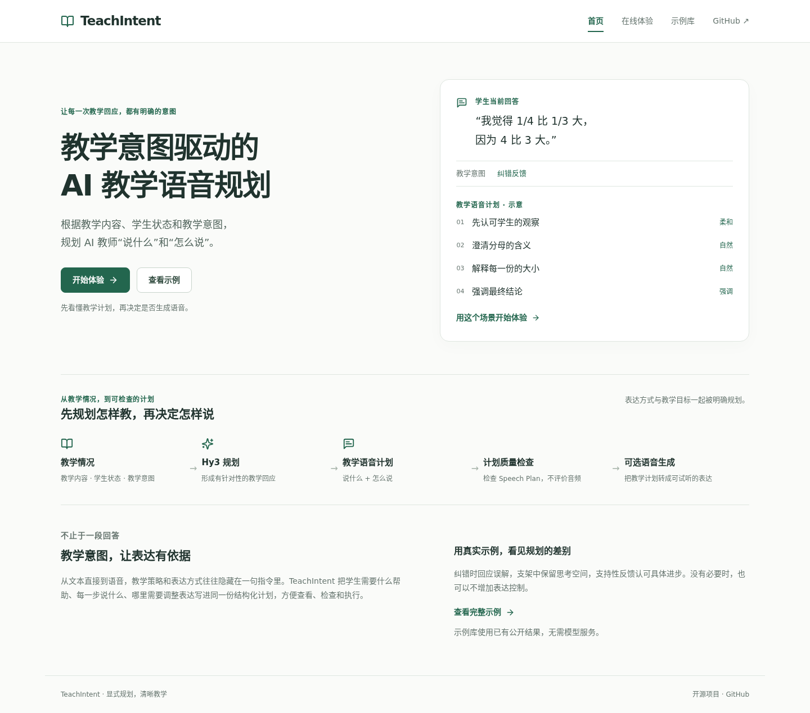
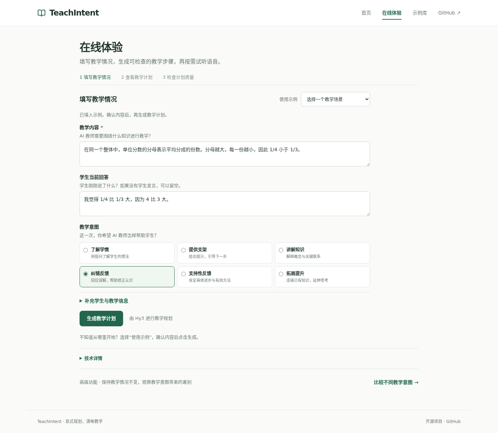
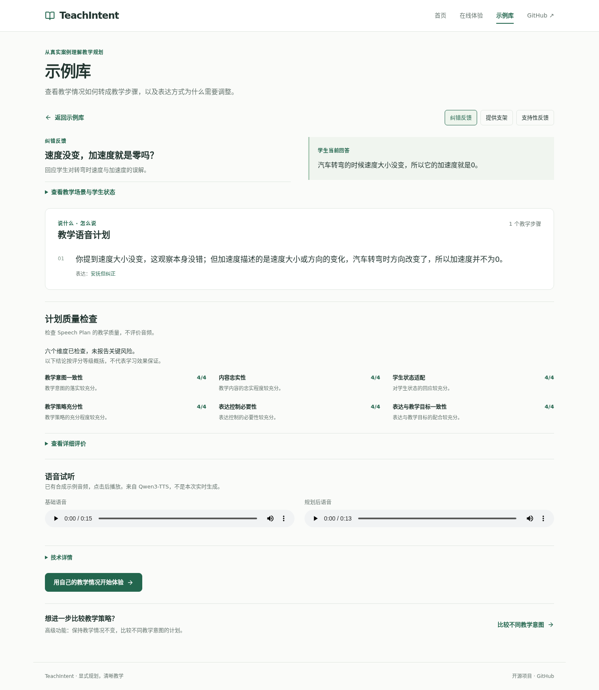

# TeachIntent

**教学意图驱动的 AI 教学语音规划系统**

TeachIntent 根据教学内容、学生状态和教学意图，利用 Hy3 生成结构化教学语音计划，显式规划 AI 教师“说什么”和“怎么说”，并提供独立质量检查与可选语音执行。

[快速开始](#快速开始) · [输入与输出](#输入与输出) · [界面预览](#界面预览) · [项目结构](#项目结构)

这是个人开源实践项目，不是 Tencent 官方发布。项目贡献是教学规划层，不是新的 TTS 模型或基础模型。

## 为什么需要 TeachIntent

纠正误解、提供提示、肯定进步，需要不同的教学回应。直接把模型回答送进 TTS，往往难以分别检查教学策略和表达方式。TeachIntent 将选定的教学意图、实际教学语言和必要的表达控制写进同一份可执行计划，让开发者和教师能看到系统准备怎样教。

## 核心流程


质量检查针对 **Speech Plan，而不是评价音频**。质量检查与语音生成是两个独立操作，用户可以按需选择。

## 功能特点

- 六类明确的教学意图，结合学生当前理解规划一次教学回应。
- 教学语言与表达控制共享稳定的段落标识，经过结构和跨字段校验。
- 按教学步骤阅读计划，表达提示直接附在对应步骤下；无需控制时保持为空。
- 六维独立质量检查，简洁中文结论与可展开的原始理由、证据。
- 三个已有公开案例和六个合成示例 WAV，无需 API key 即可浏览。
- 高级教学意图对比：保持其他输入相同，仅改变教学意图。
- 可选语音执行；分段方式仍属实验性功能，不影响核心规划的独立使用。

## 界面预览

首页说明产品与输入输出；在线体验处理一次教学回应；示例库展示已有真实结果。
以下截图来自实际产品网页，在线体验截图为填写示例后的初始状态，未调用生成服务。



<details>
<summary>在线体验与示例库</summary>





</details>

## 快速开始

需要 Python **3.10+**、Node **20.19+ 或 22.12+** 和 npm。请从仓库检出目录运行，网页会读取提交的 `examples/`、`public_demo/`、`schemas/` 和 `docs/`。浏览示例无需模型安装。

```bash
git clone https://github.com/juanmaoxiongmaoQAQ/TeachIntent.git
cd TeachIntent
python3 -m venv .venv
source .venv/bin/activate
mkdir -p outputs/tmp outputs/cache/pip outputs/cache/npm
export TMPDIR="$PWD/outputs/tmp"
export PIP_CACHE_DIR="$PWD/outputs/cache/pip"
export npm_config_cache="$PWD/outputs/cache/npm"
python -m pip install -e '.[dev]'
npm --prefix frontend ci
if [ ! -f .env ]; then
  cp .env.example .env
fi
```

终端一启动后端：

```bash
python scripts/run_web_api.py --host 127.0.0.1 --port 8000
```

终端二在项目根目录启动前端：

```bash
npm --prefix frontend run dev -- --host 127.0.0.1 --port 5173
```

打开 [本地首页](http://127.0.0.1:5173/)，选择“示例库”即可查看已有计划、评价与音频。默认 Vite 代理连接后端 8000；如改变后端端口，在前端进程中设置 `TEACHINTENT_API_TARGET`。

Linux 上也可使用兼容保留的 `scripts/start_showcase.sh` / `scripts/stop_showcase.sh` 管理本地服务。它会选择空闲端口、打印访问地址，只停止自身进程；日志在忽略的 `outputs/showcase-runtime/`。这些是开发服务器，不是生产部署配置。

### 启用实时规划与质量检查

在服务器端忽略的 `.env` 或环境变量中配置：

| 变量 | 用途 |
|---|---|
| `HY3_API_KEY` | 实时 Hy3 教学规划 |
| `HY3_BASE_URL` | 默认 `https://openrouter.ai/api/v1` |
| `HY3_MODEL` | 默认 `tencent/hy3` |
| `OPENROUTER_API_KEY` | 独立、按需触发的计划质量检查 |

后端加载根目录 `.env`，不覆盖已导出的变量。密钥只留在服务端，不能放进前端 `VITE_*` 变量或 Git。修改配置后重启后端。

进入 `/studio`，填写教学内容、学生回答并选择意图，再点击“生成教学计划”。“使用示例”只填表，不调用 Hy3；“检查计划质量”和“生成语音”也不会自动执行。没有配置实时服务时，可以继续使用示例库。

## 输入与输出

下面以单位分数纠错说明接口。输入是当前 `POST /api/generate` 的真实字段结构；内容及输出文本是**说明性示例，不冒充已记录的 Hy3 实验结果**。省略 `prompt_version` 时，网页接口使用 v0.2。

```json
{
  "content_anchor": "在同一个整体中，单位分数的分母越大，每一份越小，因此 1/4 小于 1/3。",
  "teaching_scenario": "学生把分母的大小直接当成了分数的大小。",
  "learner_utterance": "我觉得 1/4 比 1/3 大，因为 4 比 3 大。",
  "learner_level": "小学",
  "knowledge_state": "已认识分子和分母，但对单位分数的大小存在误解",
  "affective_state": "愿意表达自己的想法",
  "pedagogical_intent": "corrective_feedback"
}
```

后端将这些字段组装成输入契约 `1.0.0-rc.2`。Hy3 输出的 `speech_plan` 对应真实 Speech Plan Schema `1.0.0-rc.3`：

```json
{
  "schema_version": "1.0.0-rc.3",
  "verbal_plan": {
    "segments": [
      {"segment_id": "seg_01", "text": "你注意到 4 比 3 大，这个观察本身没有错。"},
      {"segment_id": "seg_02", "text": "不过，在分数里，分母表示把整体平均分成多少份。"},
      {"segment_id": "seg_03", "text": "对同一个整体，分得越多，每一份越小。"},
      {"segment_id": "seg_04", "text": "所以四分之一其实比三分之一小。"}
    ]
  },
  "delivery_plan": {
    "segment_overrides": [
      {"segment_id": "seg_01", "prosody": {"volume": "soft"}},
      {"segment_id": "seg_04", "prosody": {"pitch_level": "high"}}
    ]
  }
}
```

`verbal_plan` 是**说什么**；`delivery_plan` 是**怎么说**，通过段落标识引用原文。没有必要的控制可以省略，整个 `delivery_plan: {}` 也合法；网页显示“本段无需额外表达控制”。上述高语调控制只表达符号意图，不保证合成器精确实现声学目标。

API 响应还包含 `session_id`、实际输入和生成元信息。质量检查和可选 Renderer 使用同一会话中保存的计划，分别得到评价与语音，不改写计划。详细契约见 [输入模型](src/teachintent/models/input.py) 与 [Speech Plan Schema](docs/speech_plan_schema.md)。已有实测输出可见 [圆周运动 Golden Case](cases/baton_diagnostic/golden_case_1_v0_4.speech_plan.json)。

## 六类教学意图

| 中文名称 | 接口值 | 教学作用 |
|---|---|---|
| 了解学情 | `elicitation` | 用提问了解学生的知识与推理 |
| 提供支架 | `scaffolding` | 给出下一步提示，保留思考空间 |
| 讲解知识 | `explanation` | 解释概念与关键联系 |
| 纠错反馈 | `corrective_feedback` | 回应误解，帮助修正认识 |
| 支持性反馈 | `supportive_feedback` | 肯定具体进步或有效策略 |
| 拓展提升 | `extension` | 在内容边界内延伸已有理解 |

意图由调用者明确选择，系统不负责自动选择意图或多轮教学策略。定义见 [教学意图](docs/pedagogical_intents.md)。

## 计划质量检查

独立 Evaluator v0.1 检查教学意图一致性、内容忠实性、学生状态适配、教学策略充分性、表达控制必要性、表达与教学目标一致性。每维评分为 0–4，网页按评分给出简短中文概括；原始理由、证据与关键风险放在“查看详细评价”中。

证据需对应输入或计划，非法判断作为失败保留，不替换成零分或虚构证据。评分不代表学习效果、发音质量或音频自然度。方法和研究证据分别见 [评价方法](docs/EVALUATION_METHOD.md)、[结果](docs/RESULTS.md) 与 [失败分析](docs/FAILURE_ANALYSIS.md)。

## 可选语音执行

语音是次级、按需功能。已有示例音频来自 Qwen3-TTS，页面显示“基础语音 / 规划后语音”，不会自动播放。六个合成 WAV 已获项目所有者公开展示授权，来源和哈希保留在原 manifest；支持性反馈的空表达计划对应相同的 A/B 音频。

实时语音可接入已有 BatonVoice 环境。分段执行为每段独立生成音频并在浏览器顺序播放，仍标注实验性；整段执行保留在技术详情。未配置时轻量提示，不影响教学计划。配置变量、输出位置和能力边界见 [语音执行](docs/renderer.md)。

## 项目结构

```text
src/teachintent/       规划、契约、评价、适配器和 Web API
frontend/             中文产品网页、测试与 npm lockfile
schemas/              输入与 Speech Plan JSON Schema
cases/                canonical 数据与保存的诊断计划
examples/             三个公开案例及真实规划结果
public_demo/          已保存评价、六个合成 WAV 与来源 manifest
tests/                核心测试与历史证据边界
scripts/              启动、导出与冻结协议复现入口
tools/diagnostics/    独立研发诊断工具，不属于 Quick Start
docs/                 契约、方法、使用说明和公开截图
outputs/、results/    本地生成产物与历史证据，不进入 Git
```

开发入口见 [架构与版本边界](docs/architecture.md)。生成器库默认 v0.1，网页默认 v0.2，对比固定 v0.2；v0.3/v0.4 可在技术详情中显式选择。正式 v0.2 是冻结 v0.2-rc.2 的字节一致行为别名。示例库保留原始 v0.2，不能据此宣称新版本的确认性优势。

## 测试

以下门禁只使用假客户端、提交的案例和离线实现，无需 API key 或 GPU：

```bash
mkdir -p outputs/tmp
export TMPDIR="$PWD/outputs/tmp"
PYTEST_DISABLE_PLUGIN_AUTOLOAD=1 python -m pytest -q -m 'not historical_artifacts'
npm --prefix frontend test
npm --prefix frontend run build
git diff --check
```

历史 artifact 测试只有在指定不可变运行目录缺失时跳过；恢复目录后，内容、身份或哈希错误仍失败。核心门禁不会伪造历史记录。完整命令和边界见 [TESTING.md](docs/TESTING.md)。

## 第三方组件

Hy3、OpenRouter、BatonVoice、CosyVoice、WeText 和 Qwen3-TTS 各自保留其服务或组件条款。源码不携带权重、参考录音、密钥或 Tencent upstream。详见 [第三方来源与授权边界](docs/THIRD_PARTY.md)。

## 已知限制

- 只规划一次教学回应，不管理多轮教学策略，也不证明真实学习收益。
- 实时规划与质量检查依赖外部服务；会话保存在进程内，重启后需重新生成。
- 示例库是已有记录，三个情境不同，不能视为只改变意图的受控实验。
- 符号表达控制不能保证精确声学实现；分段语音仍可能存在发音波动和浏览器播放间隙。
- 网页是开发演示部署，不包含生产身份认证、配额管理或长期会话存储。

## License

TeachIntent 自有源码采用 [MIT License](LICENSE)。该许可不替代第三方模型、服务或媒体的授权条款。
