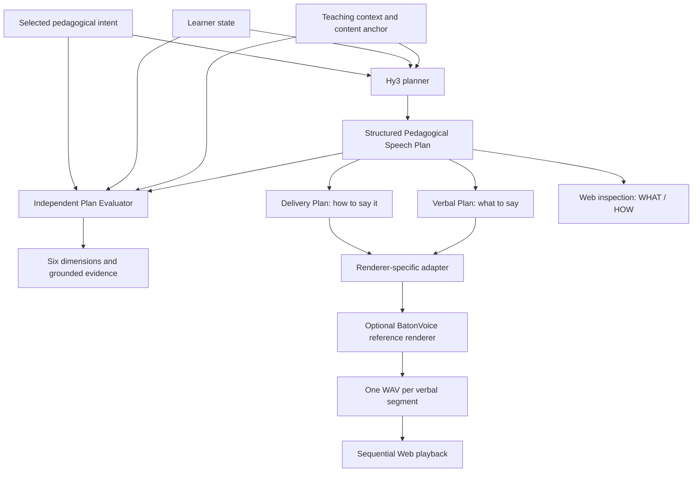

# TeachIntent

**Pedagogical Intent Driven Speech Planning for AI Tutors**

TeachIntent uses **Hy3 to plan the teaching language and its delivery before an
AI tutor speaks**. Given lesson content, teaching context, learner state and a
selected pedagogical intent, it produces an inspectable Speech Plan: **what to
say** and **how to say it**. An independent evaluator checks the plan against
its input; interchangeable adapters project delivery controls to speech engines.

This is a personal open-practice project, **not an official Tencent release**.
TeachIntent contributes the planning and evaluation layer. Hy3 supplies the
reasoning model; BatonVoice is an optional reference speech backend.

## User scenario and problem definition

A tutor should respond differently when correcting a misconception, offering a
hint, or acknowledging successful reasoning. A conventional
`context → LLM → text → TTS` pipeline leaves that teaching decision and its
delivery difficult to inspect separately.

TeachIntent makes the selected intent, wording, sparse delivery controls and
judgment evidence visible to AI-tutor developers and reviewers. It supports a
single teaching turn; selecting the next intent and managing a tutoring dialogue
remain the caller's responsibility.

## Architecture



The evaluator reads the **input and Speech Plan**, never a WAV. Evaluation and
rendering are separate user-triggered actions on the same saved plan; evaluation
is not a mandatory gate for audio playback.

### Why Hy3

Hy3 is the live reasoning/planning model (`tencent/hy3` through the configured
OpenRouter-compatible client). Its job is to integrate the lesson boundary,
learner cues and teaching intent into a directly sayable response and justified
delivery choices. This is an open-ended planning task, beyond choosing a voice
style from a template. Hy3 does not synthesize audio or evaluate its own output.
This implementation choice is not a claim of superiority over other planners.

### Key features

- Six explicit pedagogical intents, conditioned on content and learner state.
- Schema-validated, inspectable verbal and delivery plans with stable segment IDs.
- Sparse controls: an empty delivery plan is valid when no control is justified.
- Prompt selection in Live Studio: **v0.2**, **v0.3**, **v0.4**. v0.4 combines
  natural verbal segmentation with sparse local delivery for teaching stages
  such as acknowledgement, explanation and conclusion.
- Independent Evaluator v0.1: frozen rubric, strict Judge output contract,
  structured JSON grounding and bounded alias normalization.
- Conservative renderer adapters; unsupported precision is not promised.
- Explore, Live Studio and Intent Compare, including optional single-pass
  speech and an **Experimental** segmented player.

The generator library still defaults to v0.1. Live Studio defaults to v0.2;
Intent Compare explicitly uses v0.2. Formal v0.2 remains a frozen, byte-identical
behavioral alias of v0.2-rc.2. Later versions are explicitly selected development
variants, not new schemas or evidence of held-out superiority.

## Interactive Showcase

Open **`/showcase`** to quickly understand TeachIntent, review three existing
examples, inspect WHAT/HOW planning and evaluator evidence, and compare recorded
Neutral/Planned demo speech. Case selection updates the page without navigation.
The artifacts retain their actual **Prompt v0.2** label. Empty delivery is shown
as deliberate sparse planning; no additional control is invented.

Showcase uses local public artifacts and needs no API key, GPU or Baton runtime.
The six synthetic Qwen3-TTS demo recordings are approved by the project owner
for public demonstration; they are clearly separate from live Baton synthesis.
**Open Live Studio** leads to `/live` for optional provider-backed work.
Explore (`/explore`, also `/`) and Intent Compare (`/compare`) remain available.

After installing the app and frontend dependencies described below, on Linux
with Python 3.9+ and Node on `PATH`, run from the project root:

```bash
scripts/start_showcase.sh
```

The script tries backend 8000 and frontend 5173, safely selects nearby free
ports if needed, listens on `0.0.0.0` and configures the Vite proxy automatically.
Use the exact URLs it prints. Set `SHOWCASE_PYTHON=/path/to/app-env/bin/python`
if the app dependencies are in a separate Python environment. Repeating start
reuses the healthy owned servers. To stop only those servers:

```bash
scripts/stop_showcase.sh
```

PID state and per-run logs remain in ignored `outputs/showcase-runtime/`.
The controller verifies process ownership, start time and a run-specific tag
before signaling; occupied ports belonging to other services are left alone.
For remote review without a directly reachable port, use the printed SSH tunnel
command and open the forwarded localhost URL. These are development servers;
this script does not configure a production deployment or system services.

## Pedagogical intent taxonomy

| Intent | Teaching move |
|---|---|
| `elicitation` | Elicit the learner's knowledge, reasoning or next response. |
| `scaffolding` | Provide a focused hint or intermediate step without taking over. |
| `explanation` | Clarify a concept or relationship within the content anchor. |
| `corrective_feedback` | Identify and repair a misconception or error. |
| `supportive_feedback` | Acknowledge specific progress or effective reasoning. |
| `extension` | Extend understanding beyond the immediate step within the supplied boundary. |

The caller chooses the intent. See [taxonomy](docs/pedagogical_intents.md).

## Speech Plan: what to say / how to say it

This is the saved [Golden Case 1 v0.4 plan](cases/baton_diagnostic/golden_case_1_v0_4.speech_plan.json),
used for the Baton reference diagnostics. It follows Speech Plan schema
`1.0.0-rc.3`; input schema remains `1.0.0-rc.2`.

```json
{
  "schema_version": "1.0.0-rc.3",
  "verbal_plan": {
    "segments": [
      {"segment_id": "seg_01", "text": "你观察得很对，匀速圆周运动里速度的大小确实没有变。"},
      {"segment_id": "seg_02", "text": "不过，速度不仅仅包含大小，还包含方向。"},
      {"segment_id": "seg_03", "text": "物体做圆周运动时，方向在不断改变，也就是速度在变化。"},
      {"segment_id": "seg_04", "text": "所以加速度并不为零，因为加速度取决于速度的变化，包括方向的变化。"}
    ]
  },
  "delivery_plan": {
    "segment_overrides": [
      {"segment_id": "seg_01", "prosody": {"volume": "soft"}},
      {"segment_id": "seg_04", "prosody": {"pitch_level": "high"}}
    ]
  }
}
```

The Verbal Plan contains the teaching language. The Delivery Plan references
segments without rewriting their words. Here only the acknowledgement and
conclusion carry local controls; the middle explanation needs no filled-in
prosody template. Symbolic controls are planning decisions, not guaranteed
acoustic measurements. See [Speech Plan contract](docs/speech_plan_schema.md).

## Independent evaluator

Evaluator v0.1 uses six frozen dimensions, each scored 0–4:

| Dimension | What is checked |
|---|---|
| D1 — Pedagogical Intent Fidelity | Does the requested teaching move dominate? |
| D2 — Content Faithfulness / Boundary | Is the response supported by the content anchor? |
| D3 — Learner-State Compatibility | Does it fit the supplied learner cues? |
| D4 — Intent-Specific Instructional Adequacy | Is the move useful and sufficiently complete? |
| D5 — Delivery Necessity / Sparsity | Are controls minimal and justified? |
| D6 — Delivery–Pedagogy Alignment | Do the controls, or their omission, support the teaching move? |

The independent Judge's output must satisfy its contract and cite grounded input
or plan evidence. Structured delivery evidence is checked against the referenced
JSON; recognized aliases are normalized before validation. Invalid judgments
remain visible failures, not zero scores or invented evidence. The Web panel
links dimensions to their evidence. **These are plan-quality judgments, not
pronunciation, audio-fidelity or naturalness scores.**

See [evaluation method](docs/EVALUATION_METHOD.md), [recorded results](docs/RESULTS.md)
and [failure analysis](docs/FAILURE_ANALYSIS.md). Development evidence, release
sanity checks and frozen confirmatory evaluator evidence have distinct scopes;
none establishes production TTS quality or formal held-out prompt superiority.

## BatonVoice reference renderer

The optional BatonVoice adapter projects supported symbolic delivery into
conservative acoustic ranges. It preserves verbal text and segment order;
precise pause duration, word-level prosody and exact acoustic realization are
outside its contract. Model and upstream paths come from environment variables.
Heavy speech dependencies load only when rendering is explicitly requested.

Single-pass multi-segment synthesis showed later content drift, compressed
reading and weak boundaries in the recorded tests. The segmented candidate
uses **one independent synthesis per verbal segment**, writes separate WAVs and
a manifest, and plays successful segments in order using browser audio events.
It does not concatenate WAVs, insert silence, splice audio, post-process waves,
retry synthesis or use ASR fallback.

Project-owner GPU and browser listening checks reported better content fidelity,
speech rate and boundary behavior, appropriate pauses, and continuous speaker
and loudness without obvious separation into recordings. This is observed
reference-run behavior, not a universal or gapless-playback guarantee. The Web
control remains **Experimental**. See [candidate design](docs/batonvoice_segmented_candidate.md)
and [Web integration](docs/batonvoice_segmented_web.md).

## Demo / showcase

Start with **Explore**: it uses committed artifacts and needs no API key, GPU or
historical `results/` directory. Select each case, inspect WHAT/HOW, select an
evaluator dimension, and follow its grounded evidence.

| Existing showcase | What to inspect |
|---|---|
| [Corrective feedback](examples/corrective_feedback.json) | A frustrated physics learner equates unchanged speed with zero acceleration; acknowledge the valid observation and repair the direction misconception. |
| [Scaffolding](examples/scaffolding.json) | A frustrated biology learner wants all genetic-cross answers; offer the next gamete-listing step without taking over. |
| [Supportive feedback](examples/supportive_feedback.json) | Acknowledge successful transfer of coordinate-axis reading across subjects; the recorded v0.2 delivery plan is empty. |

These are existing recorded Hy3 outputs with matching evaluator artifacts, not
hardcoded substitutes for live generation. Different showcase contexts illustrate
the intents; they are not a controlled intent-only experiment.

**Live Studio** loads the corrective showcase's input only. Choose a prompt,
generate with Hy3, then optionally evaluate that saved plan and render speech.
Changing a selector does not relabel an already-generated plan. Generation and
evaluation require server-side credentials; speech requires a separate local
Baton environment. Loading a scenario never generates a plan automatically.

**Intent Compare** holds the context and learner fields constant and changes only
the selected intent. It makes two live Hy3 calls using v0.2, presents both plans
and structural differences, and does not automatically evaluate or render audio.

Explore's optional recorded neutral/planned audio is **Qwen3-TTS**, as identified
by its manifests, not BatonVoice. In the supportive-feedback example the empty
delivery plan gives identical A/B audio; no audible difference is claimed.
Golden Case 1 v0.4 supplies additional Baton diagnostic evidence, independently
of these v0.2 Explore examples. Use the [two-minute demo guide](docs/DEMO_SCRIPT.md).

## Quick start

Prerequisites: Python **3.10+** and Node **20.19+ or 22.12+** with npm. Run from a
clone of this repository; the Web app reads its committed `examples/`,
`public_demo/`, `schemas/` and `docs/` in place. No model installation is needed
for Explore or offline tests.

```bash
python3 -m venv .venv
source .venv/bin/activate
mkdir -p outputs/tmp outputs/logs outputs/cache/pip
export TMPDIR="$PWD/outputs/tmp"
export PIP_CACHE_DIR="$PWD/outputs/cache/pip"
python -m pip install -e '.[dev]'
if [ ! -f .env ]; then
  cp .env.example .env
fi
```

Leave credentials and Baton paths empty for offline Explore. Existing `.env`
files are not replaced. For a terminal-only recorded demonstration:

```bash
python scripts/run_demo.py
```

### Environment variables

Configure private values in the ignored root `.env` or export them in the server
shell. `run_web_api.py` loads the root `.env` without overriding exported values.
Never place credentials in frontend `VITE_*` variables.

| Variable | Purpose |
|---|---|
| `HY3_API_KEY` | Required for live Hy3 planning only. |
| `HY3_BASE_URL` | Default `https://openrouter.ai/api/v1`. |
| `HY3_MODEL` | Default `tencent/hy3`. |
| `OPENROUTER_API_KEY` | Independent live evaluator credential; may use the same account key. |
| `BATONVOICE_MODEL_PATH` | Existing local Baton checkpoint. |
| `BATONVOICE_COSYVOICE_MODEL_DIR` | Existing local CosyVoice2 checkpoint. |
| `BATONVOICE_SOURCE_DIR` | Existing Tencent `digitalhuman/BatonVoice` source directory. |
| `BATONVOICE_WETEXT_FST_DIR` | Existing local WeText FST assets. |
| `BATONVOICE_PROMPT_AUDIO_PATH` | Existing reference prompt WAV; preserve the verified speaker condition. |
| `BATONVOICE_TENSOR_PARALLEL_SIZE` | Existing runtime setting; example `1`. |
| `BATONVOICE_GPU_MEMORY_UTILIZATION` | Existing runtime setting; example `0.25`. |
| `BATONVOICE_FP16` | Existing runtime setting; example `0`. |
| `BATONVOICE_SPEECH_SPEED` | Preserve the validated reference setting **`0.85`**; no new tuning. |
| `TEACHINTENT_BATONVOICE_OUTPUT_DIR` | Single-pass Web output root, default `outputs` relative to TeachIntent; external paths rejected. |
| `TEACHINTENT_API_TARGET` | Optional Vite proxy target; default `http://127.0.0.1:8000`. |

Baton paths/resources are needed only for speech. The minimal Python install does
not provision the separate Baton/vLLM/CosyVoice runtime or download weights.
Use an already verified runtime for that optional demonstration. Legacy Qwen
settings are documented in [.env.example](.env.example) and [TTS notes](docs/TTS_RENDERER.md).

### Running backend

In the activated Python environment, from the repository root:

```bash
export TMPDIR="$PWD/outputs/tmp"
python scripts/run_web_api.py --host 127.0.0.1 --port 8000
```

Health: `http://127.0.0.1:8000/api/health`. Explore does not call a provider.
Live session state is bounded and in memory; restarting the server loses live
session URLs. The development server has no authentication or multi-worker
session store: use loopback for review, not an unprotected public deployment.

### Running frontend

In a second terminal, starting from the repository root:

```bash
export TMPDIR="$PWD/outputs/tmp"
export npm_config_cache="$PWD/outputs/cache/npm"
cd frontend
npm ci
npm run dev -- --host 127.0.0.1
```

Open `http://127.0.0.1:5173`. Vite proxies `/api` to the backend. `npm run build`
creates `frontend/dist/`; it does not configure production API hosting.

If either default port is occupied, leave existing services running and choose
free ports. For example, start the backend from the repository root with
`python scripts/run_web_api.py --host 127.0.0.1 --port 8001`; in the frontend
terminal, from `frontend/`, run
`TEACHINTENT_API_TARGET=http://127.0.0.1:8001 npm run dev -- --host 127.0.0.1 --port 5174 --strictPort`
and open `http://127.0.0.1:5174`. Keep the project-local temp/cache environment
from the setup above. These example ports must also be free; Vite's printed
address identifies the running frontend. A changed backend port requires the
matching `TEACHINTENT_API_TARGET`.

### Running tests

From the repository root, with the Python environment activated:

```bash
mkdir -p outputs/tmp
export TMPDIR="$PWD/outputs/tmp"
PYTEST_DISABLE_PLUGIN_AUTOLOAD=1 python -m pytest -q -m 'not historical_artifacts'
```

This is the **core release gate**: offline contracts, planner/evaluator behavior,
Web services, published examples and mock renderer/diagnostic regression tests.
No API key, model weights or GPU is required. Pytest allocates a fresh project-local
base directory under `outputs/pytest/` when no `--basetemp` is given.

Historical artifact-dependent tests are separately selectable:

```bash
PYTEST_DISABLE_PLUGIN_AUTOLOAD=1 python -m pytest -q -m historical_artifacts -rs
# After restoring the exact original frozen runs, require all prerequisites:
PYTEST_DISABLE_PLUGIN_AUTOLOAD=1 python -m pytest -q -m historical_artifacts --require-historical-artifacts
```

Missing named run directories produce explicit skips in the ordinary suite.
Existing incomplete/corrupt runs still fail their original tests. No artifacts
are generated or downloaded to make tests pass. [Testing guide](docs/TESTING.md)
lists the required run IDs and strict mode. Full available suite: `python -m pytest -q -rs`.

Frontend, from `frontend/` with the project-local cache/temp environment above:

```bash
npm test
npm run build
```

## Repository structure and release boundary

| Area | Role |
|---|---|
| `src/teachintent/{generator,models,validators,prompts,evaluator}/` | Product planning and frozen contracts; prompt selection is explicit. |
| `src/teachintent/{app_service.py,web_api.py,web_models.py}`, `frontend/` | Product Web inspection, live planning, independent evaluation and comparison. |
| `src/teachintent/{adapters,renderers}/` | Optional speech projection/execution; segmented renderer remains experimental. |
| `examples/`, `public_demo/` | Portable, committed recorded showcases and matching provenance. |
| `schemas/`, `docs/`, `cases/` | Contracts, protocols and canonical inputs. |
| `scripts/diagnose_*.py`, segmented candidate CLI, `cases/baton_diagnostic/` | Experimental diagnostics, not startup or submission prerequisites. No further TTS research is planned. |
| Retired K0 scripts | Retained locally, excluded from the public release; not application or test dependencies. |
| Pilot/baseline/prompt-development runners and marked tests | Historical experiment tooling, requiring the corresponding frozen artifacts. |
| `results/` | Ignored immutable experiment evidence; never fabricate, delete or overwrite it. |
| `outputs/` | Ignored runtime audio, manifests, logs, caches and offline verification artifacts. |

Segmented Web audio uses `outputs/baton-segmented/<run-id>/seg_*.wav` plus
`manifest.json`; single-pass Web audio defaults to
`outputs/teachintent-batonvoice/<session-id>.wav`. Neither Web route accepts an
arbitrary client filesystem path. Do not move historical evidence for release.

## Security and provenance

Keep API keys server-side and out of Git, recordings, screenshots and error
reports. `.env`, credential files, shell history, checkpoints and generated
outputs are ignored. [.env.example](.env.example) contains empty credential and
local-path fields. Review the **actual staged diff** before publishing; ignore
rules do not remove a file that is already tracked.

Hy3, Tencent BatonVoice, CosyVoice2, Qwen3-TTS and WeText are third-party
components, not new models trained by TeachIntent. Weights and upstream source
are not bundled. Public audio manifests preserve the actual Qwen model,
speaker, text hash, conditions and audio hashes. Review separate code/model
licenses and reference-audio permissions before redistribution; TeachIntent's
[MIT license](LICENSE) does not relicense third-party materials. See
[third-party provenance](docs/THIRD_PARTY.md) and [release audit](docs/RELEASE_AUDIT.md).

## Known limitations

- BatonVoice is an optional reference renderer. Single-pass long responses
  showed drift; segmented synthesis improved fidelity and boundaries in our
  tests, but local swallowing, missing final characters, unstable Mandarin
  punctuation and synthetic voice quality remain. Speech-token variation is
  stochastic. These are renderer limitations, not further release experiments.
- Precise pauses, duration, word-level prosody and production-grade expressive
  TTS are not claimed. Conservative delivery projection is intentional.
- Browser/network scheduling can affect playback gaps. Segmented audio remains
  experimental; mock tests verify controls, not human-perceived naturalness.
- The evaluator assesses plans using a fallible independent Judge; scores do
  not establish learning gains. Dataset and evidence boundaries are documented.
- This is a local single-turn review application, not a production tutoring
  service. Live planning/evaluation need provider access; speech needs a
  separately provisioned compatible runtime.

## Submission materials

Use the [Task 1 compliance matrix](docs/TASK1_COMPLIANCE.md),
[two-minute demo guide](docs/DEMO_SCRIPT.md) and
[submission checklist](docs/SUBMISSION_CHECKLIST.md). Source readiness and a finished
submission package are separate: prepare the final recording and submission
links as required by the destination. The owner approved the source publication
and six existing synthetic demo WAVs; see [third-party provenance](docs/THIRD_PARTY.md).
